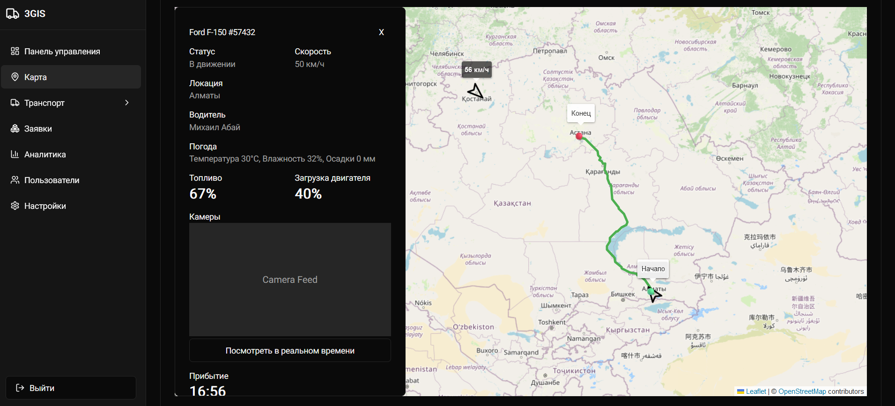

# 3GIS

## Overview

**3GIS** is a full-stack web application designed to help companies that transport oil efficiently manage and control their entire transportation system. The application provides real-time tracking of vehicles through GIS data and telemetry, allowing administrators and managers to monitor transport routes and vehicle performance on an intuitive dashboard.

The platform integrates geolocation and telemetry data from individual vehicles, visualizing this data through interactive maps using Mapbox for precise route monitoring. It also includes powerful backend support for handling large geographic datasets, optimized through PostGIS in PostgreSQL for faster query response times.

## Features

- **Real-time vehicle tracking**: Get real-time updates on transport routes using GIS and telemetry data from each vehicle.
- **Interactive map visualization**: View and analyze transport routes through interactive maps powered by Mapbox.
- **Telemetry data integration**: Monitor vehicle performance, fuel usage, and other critical telemetry data to ensure efficient operations.
- **Optimized data queries**: Spatial queries are optimized with PostGIS in PostgreSQL to handle large datasets quickly and efficiently.
- **Dockerized deployment**: The application is containerized using Docker for easy deployment and consistent development environments.

## Tech Stack

- **Frontend**:
    - Next.js
    - React
    - HTML/CSS
    - JavaScript

- **Backend**:
    - Node.js
    - Express.js

- **Database**:
    - PostgreSQL with PostGIS extension for geographic data
    - Redis for caching and real-time updates

- **Mapping**:
    - Leaflet for geolocation and route visualization
